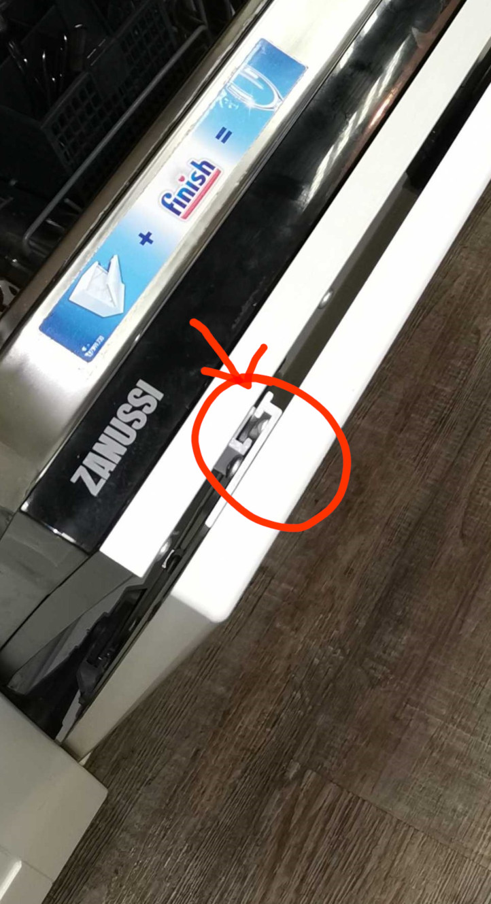

# CAD

## `styron`

3D modell [Styron egy gombos, monoblokkos öblítőszelephez](https://styron.hu/termek/monoblokkos-oblitoszelep-egy-gombos/).

## `toilet-paper-dispenser-opener-key`

Toalett papír adagoló burok nyitó műanyag kulcs 3D modell.

## `dishwasher-door-fixer`

IKEA-ban vásárolt beépíthető mosogatógép külső borítását, ajtaját rögtíző műanyag csúszó "papucs".

